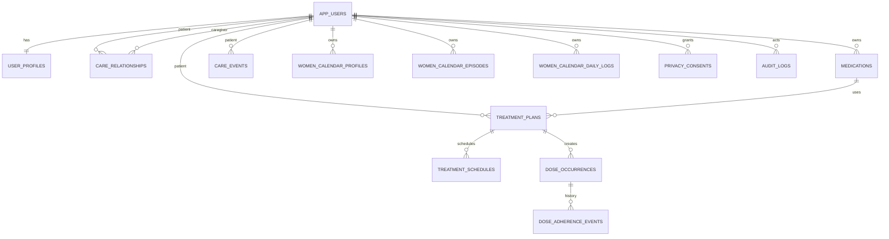
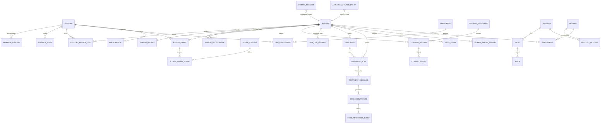

# LifeMate ecosystem data model

Status: architecture decision for `feat/ecosystem-data-foundation`  
Verified against GitHub `main` and the live Supabase schema on 2026-08-07.

## Current-state findings

The current model uses `lifemate.app_users` as both login account and health-data subject. The same identifier is referenced by treatment, care and women-health tables. `user_profiles` mixes presentation profile fields with phone/email PII. `care_relationships.can_view_women_calendar` mixes a human relationship with a permission. Consent is represented by a narrow `privacy_consents` table. The live database also contains additive SQL tables that are not represented by the EF Core model, so the repository currently has two schema-evolution paths.

A destructive reset is explicitly forbidden for this refactor because the connected Supabase project contains identities that are not all clearly synthetic.

## Before ERD

## Target ERD

## Design rules

- `Account` is a stable LifeMate login principal. `Person` is the data subject. A person can exist without an account.
- Existing IDs are preserved during migration: each existing `app_users.id` is backfilled as both an account ID and the self-person ID. New accounts/persons are independent.
- Domain ownership migrates to `person_id`. Legacy `*_user_id` columns remain temporarily as compatibility columns.
- Natural family relationships remain separate from professional domain engagements. Future fitness/clinical roles belong to their own engagement/case tables, not a universal EAV relationship table.
- Permissions are represented by typed scopes, not booleans on relationships.
- Paid capabilities are represented by entitlements and never replace data authorization or consent.
- Future domains are not pre-created. Pregnancy, baby, fitness and clinical must follow these contracts when their first real feature is implemented.
- JSONB is reserved for bounded metadata/event payloads; primary domain facts stay typed and constrained.
